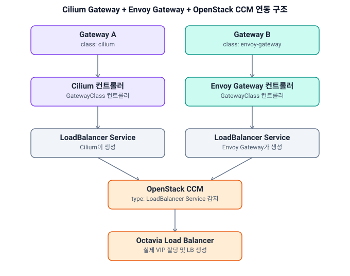
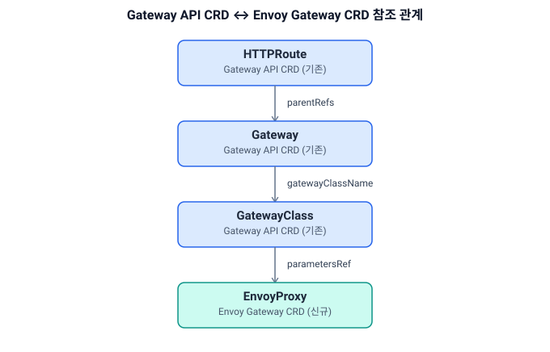
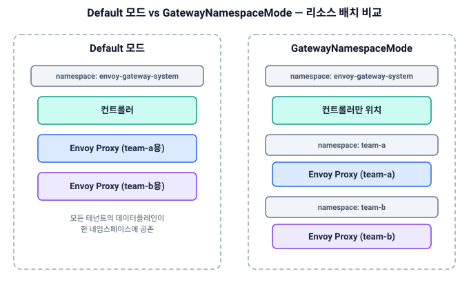

# Envoy Gateway on Cilium/OpenStack 클러스터 — 구성 정리

> 환경: CAPI v1.12.3 / CAPO v0.14.1, Kubernetes v1.35.2 (kubeadm), Cilium v1.19.1 (Gateway API 활성화),
> OpenStack CCM(Octavia)이 LoadBalancer IPAM 전담, 사설 레지스트리 `10.14.22.22/dockerhub-proxy`(Docker Hub 프록시).
> Envoy Gateway v1.9.1 도입 검토/테스트 과정 정리.

---



*위: 두 GatewayClass가 각자 컨트롤러를 통해 독립적으로 LoadBalancer Service를 만들고, OpenStack CCM이 그 Service들을 감지해 Octavia LB로 연결하는 전체 흐름. Envoy Gateway가 만드는 Service의 annotation은 `EnvoyProxy.spec.provider.kubernetes.envoyService.annotations`를 통해서만 주입된다 (2, 3번 참고).*

---

## 1. Cilium Gateway와 Envoy Gateway를 같은 클러스터에서 같이 쓸 수 있는 이유

Gateway API는 "GatewayClass의 `controllerName`을 감시하는 구현체가 해당 Gateway를 처리한다"는 구조라, 한 클러스터에 여러 구현체가 공존할 수 있다.

- Cilium: `gatewayAPI.enabled: true`로 배포되면 컨트롤러 이름 `io.cilium/gateway-controller`를 가진 GatewayClass(이름 `cilium`)를 만들고, 여기 속한 Gateway를 자신이 처리.
- Envoy Gateway: 컨트롤러 이름 `gateway.envoyproxy.io/gatewayclass-controller`를 가진 별도 GatewayClass(이름 `envoy-gateway` 등 자유)를 만들어 그 컨트롤러가 처리.

각 컨트롤러는 자기 controllerName과 일치하는 GatewayClass만 watch하므로 서로 충돌하지 않는다. `spec.gatewayClassName` 값으로 어느 컨트롤러가 처리할지 결정됨.

---

## 2. OpenStack CCM ↔ Octavia LB 연동 구조 및 annotation 위치 차이

- Cilium Gateway, Envoy Gateway 둘 다 실제로는 **Kubernetes `Service` 오브젝트(`type: LoadBalancer`)를 대신 생성**해주는 역할만 한다.
- OpenStack CCM은 이 Service를 누가 만들었는지 상관하지 않고, `type: LoadBalancer`이고 `.spec.loadBalancerClass`가 비어있는 모든 Service를 watch해서 Octavia LB를 프로비저닝한다.
- **차이는 annotation을 어디에 붙이느냐**:
  - 일반(수동) Service → `metadata.annotations`에 직접 부여
  - Envoy Gateway → **`Gateway.metadata.annotations`에 직접 붙여도 반영 안 됨**. 반드시 `EnvoyProxy.spec.provider.kubernetes.envoyService.annotations`를 통해서만 생성되는 Service에 전달됨 (AWS EKS, Oracle Cloud의 공식 Envoy Gateway 가이드도 동일 패턴 사용)
  - `Gateway.spec.infrastructure.annotations`(Gateway API 표준 필드, "Gateway Infrastructure Propagation")는 **Envoy Gateway 기본(default) 모드에서는 미지원** — 공식 conformance 결과 ❌. **GatewayNamespaceMode에서는 지원**(✅) — 아래 10~12번 참고.

**Port 설정**은 개념적으로 동일: `Service.spec.ports[].port` 대신 `Gateway.spec.listeners[].port`가 그대로 생성되는 Service의 포트가 됨. privileged port(<1024)는 내부적으로 자동 리매핑.

---

## 3. OpenStack CCM 연동에 쓸 수 있는 annotation 목록 (실제 소스코드 확인 완료)

| Annotation | 용도 |
|---|---|
| `loadbalancer.openstack.org/subnet-id` | VIP를 만들 Neutron 서브넷 ID |
| `loadbalancer.openstack.org/network-id` | VIP 할당 네트워크 ID (subnet-id 지정 시 무시됨) |
| `loadbalancer.openstack.org/member-subnet-id` | backend member 등록에 쓰는 서브넷 |
| `loadbalancer.openstack.org/port-id` | 미리 생성한 Neutron 포트를 VIP로 사용 (고정 IP의 정석 경로) |
| `loadbalancer.openstack.org/load-balancer-id` | 기존 Octavia LB 재사용/adopt. **생성 후 변경 금지** |
| `service.beta.kubernetes.io/openstack-internal-load-balancer` | `"true"`면 FIP 없이 내부 VIP만 사용 |
| `loadbalancer.openstack.org/floating-network-id`, `.../floating-subnet-id`, `.../floating-subnet` | 외부(Floating IP) 네트워크/서브넷 지정 |
| `loadbalancer.openstack.org/class` | cloud-config에 미리 정의한 class 사용 — 지정 시 위 annotation들보다 **우선순위가 높음**(주의) |

**전부 `EnvoyProxy.spec.provider.kubernetes.envoyService.annotations`에 넣어야 동작**(2번 항목 참고). CCM은 Service를 누가 만들었는지 신경 쓰지 않으므로 그대로 통과됨.

**구조적 주의사항**: `port-id`, `load-balancer-id`는 Gateway 1개 : 리소스 1개 관계라, 여러 Gateway가 같은 EnvoyProxy(=GatewayClass 공유 기본값)를 쓰면 충돌한다. Gateway별로 다르게 주고 싶으면 `Gateway.spec.infrastructure.parametersRef`로 전용 EnvoyProxy를 따로 만들어 연결해야 함.

```yaml
apiVersion: gateway.envoyproxy.io/v1alpha1
kind: EnvoyProxy
metadata:
  name: envoy-proxy-fixed-vip
  namespace: envoy-gateway-system
spec:
  provider:
    type: Kubernetes
    kubernetes:
      envoyService:
        type: LoadBalancer
        annotations:
          loadbalancer.openstack.org/port-id: "<neutron-port-uuid>"
          loadbalancer.openstack.org/member-subnet-id: "<member-subnet-uuid>"
```

---

## 4. IPAM / IPPool

- 이 클러스터는 **OpenStack CCM(Octavia)이 LoadBalancer IPAM을 전담**.
- Cilium도 자체 LB-IPAM 기능을 갖고 있음. LB-IPAM은 **항상 활성 상태지만 "휴면(dormant)"** 상태이며, 클러스터에 `CiliumLoadBalancerIPPool`이 하나라도 생기는 순간 깨어남.
- 확인 결과: `kubectl get ciliumloadbalancerippools` → **없음** → Cilium LB-IPAM은 실질적으로 아무 일도 안 함. 안전.
- 다만 `helm -n kube-system get values cilium`에 `defaultLBServiceIPAM: lbipam`(차트 기본값)이 **명시적으로 설정**돼 있음 — 이건 "loadBalancerClass 미설정 서비스는 내가 처리해도 된다"는 정책이라, 나중에 누군가 실수로 IP Pool을 하나라도 만들면 그 순간부터 CCM과 경합 시작됨(잠재적 지뢰).
- **권장 조치**: `defaultLBServiceIPAM: none`으로 변경 → loadBalancerClass가 명시적으로 Cilium 클래스로 지정된 서비스만 Cilium이 처리, 나머지(Envoy Gateway 포함 사실상 전부)는 CCM이 전담.

```bash
helm -n kube-system upgrade cilium cilium/cilium \
  --version 1.19.1 --reuse-values \
  --set defaultLBServiceIPAM=none
kubectl -n kube-system rollout restart deployment/cilium-operator
```

- 확인용 명령:
```bash
kubectl get ciliumloadbalancerippools -o yaml
kubectl get svc -A -o json | jq '.items[] | select(.spec.type=="LoadBalancer") | {name:.metadata.name, ns:.metadata.namespace, ip:.status.loadBalancer.ingress, conditions:.status.conditions}'
```
(`status.conditions`에 `io.cilium/lb-ipam-request-satisfied` 조건이 있으면 Cilium이 그 서비스를 리컨사일 시도했다는 뜻)

---

## 5. CRDs



*위 다이어그램의 참조 체인(`HTTPRoute → Gateway → GatewayClass → EnvoyProxy`)은 8번 항목(수정 시 영향 범위)에서도 그대로 쓰인다.*

두 그룹으로 나뉜다.

| CRD 그룹 | 상태 | 비고 |
|---|---|---|
| Gateway API CRD (Gateway, GatewayClass, HTTPRoute, GRPCRoute, TLSRoute, ReferenceGrant, BackendTLSPolicy) | **이미 설치됨** (Cilium `gatewayAPI.enabled=true`로 함께 설치, v1.4.1, experimental 채널) | 재설치 불필요 |
| Envoy Gateway 전용 CRD (EnvoyProxy, Backend, BackendTrafficPolicy, ClientTrafficPolicy, EnvoyExtensionPolicy, EnvoyPatchPolicy, HTTPRouteFilter, SecurityPolicy) | **신규 설치 필요** | `gateway-helm` 차트 안 서브차트 경로: `charts/crds/crds/generated` |

**주의**: `gateway-helm` 차트의 `crds.enabled`는 위 두 그룹을 **한 번에** 켜고 끄는 단일 스위치다(서브차트 구조라 세분화 옵션 없음). `crds.enabled=false`로 설치하면 Gateway API CRD 재설치는 막히지만 Envoy Gateway 전용 CRD도 같이 안 깔리므로, **전용 CRD는 반드시 별도로 apply**해야 한다.

```bash
kubectl apply --server-side -f ./gateway-helm/charts/crds/crds/generated
kubectl get crd | grep gateway.envoyproxy.io   # 8종 확인
```

(참고: `gateway-crds-helm`이라는 독립 차트를 쓰면 `crds.gatewayAPI.enabled` / `crds.envoyGateway.enabled`를 따로 켤 수 있지만, 이건 `gateway-helm` 안의 서브차트와는 다른 별개 차트임.)

---

## 6. 버전 호환성

- Gateway API 공식 conformance 매트릭스 확인 결과, Envoy Gateway v1.7.0과 최신 main 브랜치(latest) 모두 **Gateway API v1.4.1**을 사용 → 그 사이 버전인 v1.8/v1.9(우리가 쓰는 v1.9.1 포함)도 동일할 가능성이 매우 높음.
- 결론: 클러스터에 이미 설치된 Gateway API **v1.4.1 CRD가 Envoy Gateway v1.9.1이 기대하는 버전과 정확히 일치** → CRD 업그레이드 불필요.
- Kubernetes 버전: Envoy Gateway v1.7 기준 지원 범위 v1.32~v1.35 → 클러스터 v1.35.2로 호환.
- v1.9.0 breaking change 참고: Gateway API "safe-upgrades" `ValidatingAdmissionPolicy`가 CRD 번들이 아니라 헬름 템플릿 쪽에서 관리되도록 바뀜. `crds.enabled=false`로 설치 시 이 리소스가 자동 생성 안 될 수 있음(테스트엔 영향 없음, 운영 반영 시 확인 필요).

```bash
kubectl get validatingadmissionpolicy safe-upgrades.gateway.networking.k8s.io 2>&1
```

---

## 7. EnvoyProxy의 필요성과 YAML 설정 의미

**필요한 이유** (이 환경에서는 사실상 필수):
1. **이미지 레지스트리 오버라이드** — `10.14.22.22/dockerhub-proxy` 반영은 Gateway API 표준 필드에 없는 개념이라 EnvoyProxy가 유일한 경로.
2. **Octavia LB annotation** — `Gateway.spec.infrastructure.annotations`가 기본 모드에선 막혀 있어 EnvoyProxy가 유일한 경로 (2, 3번 참고).

**YAML 필드 설명**:

```yaml
apiVersion: gateway.envoyproxy.io/v1alpha1
kind: EnvoyProxy
metadata:
  name: envoy-proxy-config          # GatewayClass의 parametersRef.name과 일치해야 연결됨
  namespace: envoy-gateway-system   # parametersRef.namespace와 일치해야 함
spec:
  provider:
    type: Kubernetes                # 현재 Kubernetes만 지원
    kubernetes:
      envoyDeployment:
        container:
          image: 10.14.22.22/dockerhub-proxy/envoyproxy/envoy:<tag>
          # 실제 데이터플레인 컨테이너 이미지. 미지정 시 global.imageRegistry가
          # 반영된 차트 기본값이 자동 사용됨.
      envoyService:
        type: LoadBalancer          # LoadBalancer(기본) | ClusterIP | NodePort
        annotations: {}             # OpenStack CCM annotation 주입 통로 (3번 참고)
```

기타 자주 쓰는 필드: `envoyDeployment.replicas`, `.resources`, `.pod.nodeSelector`, `envoyService.loadBalancerClass`, `logging.level`, `telemetry.metrics/.tracing`.

---

## 8. EnvoyProxy(eproxy) / GatewayClass(gc) / Gateway(gtw) 관계 — 수정 시 영향 범위

참조 체인 다이어그램은 5번 항목 참고: `HTTPRoute --parentRefs--> Gateway --gatewayClassName--> GatewayClass --parametersRef--> EnvoyProxy`

| 수정 대상 | 영향 범위 |
|---|---|
| **GatewayClass가 가리키는 EnvoyProxy**(gc.parametersRef) 내용 수정 | 그 GatewayClass를 쓰는 **모든 Gateway**에 영향 (클래스 전체 공유 기본값) |
| **Gateway.spec.infrastructure.parametersRef**로 별도 EnvoyProxy 지정 | **그 Gateway 하나만** 오버라이드, 다른 Gateway는 클래스 기본값 유지 |
| GatewayClass의 `controllerName` 변경 | 해당 클래스에 속한 모든 Gateway가 처리 주체 자체를 잃음(다른 컨트롤러로 이관됨) — 사실상 재구성 |
| Gateway의 `gatewayClassName` 변경 | 그 Gateway 하나만 다른 클래스(다른 컨트롤러/다른 기본 EnvoyProxy)로 이동 |

**정리**: GatewayClass 레벨 EnvoyProxy = "공통 기본값", Gateway 레벨 `infrastructure.parametersRef` = "개별 오버라이드". 여러 Gateway가 다른 설정(다른 서브넷, 다른 이미지, 다른 replica 등)이 필요할 때만 후자를 쓴다.

---

## 9. EnvoyProxy의 infrastructure(annotation) 관련 설정을 바꾸면 Octavia LB도 갱신되나?

- OpenStack CCM은 Service 오브젝트의 annotation 변경을 감지해서 **일부 속성은 기존 Octavia 리소스에 실시간 반영**한다 (예: timeout류, connection-limit, x-forwarded-for 등은 리스너 설정을 업데이트하는 것으로 공식 확인됨).
- 하지만 **VIP/리소스 자체를 가리키는 값은 안전하게 변경되지 않는다**:
  - `load-balancer-id`: 공식 문서에 "Service 생성 성공 후에는 이 annotation을 업데이트하지 말 것 — 관계가 깨진다"고 명시.
  - `port-id`: 이미 배정된 VIP 포트를 바꾸는 것과 같아서, 운영 중 변경 시 기존 LB와의 연결이 끊기고 새 LB가 만들어지거나 에러가 날 위험이 큼.
  - `subnet-id`/`network-id`: VIP가 이미 특정 서브넷에 만들어진 뒤 이 값을 바꾸면 LB 재생성이 필요할 수 있음(무중단 변경 아님).
- **결론**: EnvoyProxy를 수정하면 Envoy Gateway 컨트롤러가 생성된 Service에 새 annotation을 반영하고, CCM이 그 변경을 watch해서 **동작을 시도는 하지만**, 위에 나열한 "리소스 아이덴티티성" annotation은 운영 중 변경을 피하고 처음부터 올바르게 지정하는 것이 안전하다. 실험적으로 바꿔볼 거면 테스트 Gateway로 먼저 검증할 것.

---

## 10. Envoy Gateway 설치 방법 (Default 모드) — 최종 정리

### 사전 확인 완료 사항
- Gateway API v1.4.1 CRD 이미 설치 + 호환 확인됨 (6번)
- `CiliumLoadBalancerIPPool` 없음 → 테스트 안전 (4번)
- 이미지 레지스트리: `10.14.22.22/dockerhub-proxy`

### 절차

```bash
# 1) 인터넷 되는 호스트에서 차트 다운로드
helm pull oci://docker.io/envoyproxy/gateway-helm --version v1.9.1 --untar
# 구조: gateway-helm/charts/crds/crds/{gatewayapi-crds.yaml, generated/}
#       gateway-helm/templates/ (컨트롤러 관련 매니페스트)

# 2) 내부망 반입 후, Envoy Gateway 전용 CRD만 적용 (Gateway API CRD는 그대로 둠)
kubectl apply --server-side -f ./gateway-helm/charts/crds/crds/generated
kubectl get crd | grep gateway.envoyproxy.io

# 3) values 작성 (values-envoy-gateway.yaml)
#    crds:
#      enabled: false
#    global:
#      imageRegistry: "10.14.22.22/dockerhub-proxy"

# 4) 로컬 차트로 설치
helm install eg ./gateway-helm \
  -n envoy-gateway-system --create-namespace \
  -f values-envoy-gateway.yaml
kubectl -n envoy-gateway-system rollout status deployment/envoy-gateway

# 5) 설치 확인
kubectl -n envoy-gateway-system get deploy envoy-gateway \
  -o jsonpath='{.spec.template.spec.containers[0].image}{"\n"}'
kubectl -n envoy-gateway-system get job -l app.kubernetes.io/component=certgen
kubectl -n envoy-gateway-system get secret envoy-gateway envoy envoy-rate-limit
```

### EnvoyProxy + GatewayClass + 샘플 Gateway

```yaml
# envoyproxy-and-gatewayclass.yaml
apiVersion: gateway.envoyproxy.io/v1alpha1
kind: EnvoyProxy
metadata:
  name: envoy-proxy-config
  namespace: envoy-gateway-system
spec:
  provider:
    type: Kubernetes
    kubernetes:
      envoyService:
        type: LoadBalancer
---
apiVersion: gateway.networking.k8s.io/v1
kind: GatewayClass
metadata:
  name: envoy-gateway
spec:
  controllerName: gateway.envoyproxy.io/gatewayclass-controller
  parametersRef:
    group: gateway.envoyproxy.io
    kind: EnvoyProxy
    name: envoy-proxy-config
    namespace: envoy-gateway-system
```

```yaml
# gateway-test.yaml
apiVersion: gateway.networking.k8s.io/v1
kind: Gateway
metadata:
  name: eg-test
  namespace: envoy-gateway-system
spec:
  gatewayClassName: envoy-gateway
  listeners:
    - name: http
      protocol: HTTP
      port: 80
      allowedRoutes:
        namespaces:
          from: Same
```

```bash
kubectl apply -f envoyproxy-and-gatewayclass.yaml
kubectl apply -f gateway-test.yaml

# 검증
kubectl get gateway -n envoy-gateway-system eg-test -o wide
kubectl get svc -n envoy-gateway-system -l gateway.envoyproxy.io/owning-gateway-name=eg-test
openstack loadbalancer list

# 정리
kubectl delete -f gateway-test.yaml
kubectl delete -f envoyproxy-and-gatewayclass.yaml
helm uninstall eg -n envoy-gateway-system
```

### templates/ 디렉토리 구성 (참고)

| 분류 | 파일 |
|---|---|
| 네임스페이스/부트스트랩 | `namespace.yaml`, `NOTES.txt` |
| 인증서 발급 | `certgen.yaml`(pre-install Job, xDS mTLS 인증서 생성), `certgen-rbac.yaml` |
| 컨트롤 플레인 워크로드 | `envoy-gateway-deployment.yaml`, `envoy-gateway-config.yaml`(정적 EnvoyGateway 설정), `envoy-gateway-serviceaccount.yaml`, `envoy-gateway-rbac.yaml`, `envoy-gateway-service.yaml`, `envoy-gateway-hpa.yaml`, `envoy-gateway-poddisruptionbudget.yaml` |
| 권한 세분화 | `infra-manager-rbac.yaml`(ClusterRole, default 모드/namespaceSelector 모드용), `namespaced-infra-manager-rbac.yaml`(Role, GatewayNamespaceMode + 명시적 namespace 목록용), `leader-election-rbac.yaml` |
| 웹훅 | `envoy-proxy-topology-injector-webhook.yaml` (zone-aware routing용, 오늘 테스트와 무관) |
| 헬퍼(직접 렌더링 안 됨) | `_helpers.tpl`, `_rbac.tpl` |

---

## 11. Default 모드 vs GatewayNamespaceMode 차이 정리



| 항목 | Default (Controller Namespace) | GatewayNamespaceMode |
|---|---|---|
| Envoy proxy Deployment/Service/SA 위치 | 전부 `envoy-gateway-system`에 집중 | Gateway와 **같은 네임스페이스**에 분산 생성 |
| 원래 설계 목적 | 컨트롤러에게 **최소 권한**만 부여 (컨트롤러+데이터플레인이 같은 네임스페이스) | 테넌트 간 **강한 격리**(각자 네임스페이스 안에서 자기 Envoy proxy 소유) |
| 컨트롤러 RBAC | 자기 네임스페이스에만 쓰기 권한 | 여러(또는 전체) 네임스페이스에 쓰기 권한 필요 (ClusterRole 확장) |
| 컨트롤러가 뚫렸을 때 피해 범위 | 한 네임스페이스로 한정 | 여러/전체 네임스페이스로 확대될 수 있음 |
| 같은 네임스페이스 내 다른 테넌트가 뚫렸을 때 | 옆 테넌트 Envoy 리소스에 손댈 여지 있음 | 자기 네임스페이스 밖으로 못 나감 |
| control-plane ↔ data-plane 인증 | mTLS (양방향 인증서) | server-side TLS + JWT 토큰 검증 (proxy pod는 클라이언트 인증서 없음, CA만 보유) |
| `Gateway.spec.infrastructure.annotations` 지원 | ❌ (공식 conformance 확인) | ✅ (공식 conformance 확인) |
| 새 테넌트 온보딩 | 아무 네임스페이스에나 Gateway 생성하면 바로 됨 | `watch.namespaces` 명시 방식이면 관리자가 values 수정 + helm upgrade 필요 (`namespaceSelector` 방식이면 라벨만 붙이면 됨, 대신 ClusterRole로 회귀) |
| Merged Gateways 지원 | 지원 | **미지원** (13번 참고) |

**결론**: 어느 쪽이 "더 안전"한 게 아니라 **위협 모델이 다름** — 격리(GatewayNamespaceMode) vs 컨트롤러 권한 최소화(Default)의 트레이드오프. 멀티테넌시가 실제로 필요할 때만 GatewayNamespaceMode를 옵트인하는 것이 맞음.

---

## 12. GatewayNamespaceMode 대화 내용 정리

### 만들어진 이유 (모티베이션)
- Default 모드는 "컨트롤러 최소 권한"을 위해 컨트롤 플레인과 데이터플레인을 같은 네임스페이스에 두도록 설계됨.
- 이 설계의 부작용: 여러 테넌트가 각기 다른 네임스페이스에 Gateway를 만들어도, 실제 Envoy proxy pod는 전부 `envoy-gateway-system`에 뒤섞여 존재 → 네임스페이스 단위 격리(NetworkPolicy, ResourceQuota) 적용 불가, 한 테넌트가 침해당하면 옆 테넌트 리소스 접근 시도 가능 (ControlPlane의 Envoy Gateway 위협 모델링에서 실제로 검증한 시나리오).
- GatewayNamespaceMode 이전(v0.6.0 이전) 임시 해법: 테넌트마다 별도 컨트롤러를 각자 네임스페이스에 배포 — 무겁고, 컨트롤러 1개당 GatewayClass 1개 제약까지 있어 테넌트 수만큼 컨트롤러를 늘려야 했음.
- GatewayNamespaceMode = 컨트롤러는 하나만 유지하면서 데이터플레인만 테넌트 네임스페이스로 분산 → 가벼운 격리 달성.

### 설정 방법
```yaml
config:
  envoyGateway:
    provider:
      type: Kubernetes
      kubernetes:
        deploy:
          type: GatewayNamespace
```
또는 CLI:
```bash
helm install --set config.envoyGateway.provider.kubernetes.deploy.type=GatewayNamespace \
  eg oci://docker.io/envoyproxy/gateway-helm --version v1.9.1 \
  -n envoy-gateway-system --create-namespace
```

### Watch 모드에 따른 RBAC 차이
| Watch 설정 | 생성되는 RBAC |
|---|---|
| 기본값(전체 네임스페이스 watch) | `ClusterRole` (`gateway-helm-cluster-infra-manager`) |
| `watch.namespaces`로 명시적 목록 지정 | 지정된 각 네임스페이스에 `Role`(namespace-scoped) |
| `watch.namespaceSelector`로 라벨 기반 | 동적이라 다시 `ClusterRole` |

```yaml
config:
  envoyGateway:
    provider:
      kubernetes:
        deploy:
          type: GatewayNamespace
        watch:
          type: Namespaces
          namespaces: [team-a, team-b]
```

### 제약사항
- **Merged Gateways와 병행 불가** (13번 참고)

### 테스트 확인 방법
```bash
kubectl create namespace gw-ns-test
kubectl apply -f - <<'EOF'
apiVersion: gateway.networking.k8s.io/v1
kind: Gateway
metadata:
  name: gw-ns-test
  namespace: gw-ns-test
spec:
  gatewayClassName: envoy-gateway
  listeners:
    - name: http
      protocol: HTTP
      port: 80
EOF
kubectl get deploy,svc -n gw-ns-test   # envoy-gateway-system이 아니라 여기 생기면 정상
```

`Gateway.spec.infrastructure.annotations` 동작 여부도 같은 방식으로 직접 검증 가능:
```yaml
spec:
  infrastructure:
    annotations:
      loadbalancer.openstack.org/subnet-id: "test-value"
```
```bash
kubectl get svc -n gw-ns-test -o jsonpath='{.items[0].metadata.annotations}'
```

---

## 13. Merged Gateways

- `EnvoyProxy.spec.mergeGateways: true`로 활성화.
- 같은 GatewayClass 아래 있는 **여러 Gateway의 리스너를 하나의 공유 Envoy fleet(Deployment+Service)으로 합쳐서** 처리하는 기능. 기본은 Gateway 1개 = 전용 fleet 1개.
- 용도: Envoy pod 개수 절약, floating IP 절약(OpenStack처럼 IP가 귀한 환경에서 유용).
- 제약: 합쳐지는 모든 Gateway의 listener는 port+protocol+hostname 조합이 서로 겹치면 안 됨.
- **GatewayNamespaceMode와 병행 불가한 이유**: GatewayNamespaceMode는 "이 Gateway는 자기 네임스페이스에 전용 fleet을 가진다"가 전제인데, mergeGateways는 "여러 Gateway가 fleet 하나를 공유한다"는 정반대 전제라 — 여러 팀의 Gateway를 하나의 fleet으로 합칠 경우 그 fleet을 어느 네임스페이스에 둘지부터 답이 없어 구조적으로 양립 불가.

---

## 참고 링크

| 주제 | 링크 |
|---|---|
| Gateway API 공식 문서 | https://gateway-api.sigs.k8s.io/ |
| Gateway API 구현체별 conformance 지원 현황 (v1.4, Gateway Infrastructure Propagation 등) | https://gateway-api.sigs.k8s.io/docs/implementations/versions/v1.4/ |
| Kubernetes 공식 문서 - Service (`loadBalancerClass`) | https://kubernetes.io/docs/concepts/services-networking/service/ |
| Envoy Gateway 공식 문서 홈 | https://gateway.envoyproxy.io/ |
| Envoy Gateway - Gateway Namespace Mode | https://gateway.envoyproxy.io/latest/tasks/operations/gateway-namespace-mode/ |
| Envoy Gateway - Deployment Mode | https://gateway.envoyproxy.io/latest/tasks/operations/deployment-mode/ |
| Envoy Gateway - Customize EnvoyProxy | https://gateway.envoyproxy.io/latest/tasks/operations/customize-envoyproxy/ |
| Envoy Gateway - Install with Helm | https://gateway.envoyproxy.io/latest/install/install-helm/ |
| Envoy Gateway - Gateway Helm Chart API | https://gateway.envoyproxy.io/latest/install/gateway-helm-api/ |
| Envoy Gateway - Gateway CRDs Helm Chart API (독립 crds 차트) | https://gateway.envoyproxy.io/latest/install/gateway-crds-helm-api/ |
| Envoy Gateway GitHub Releases (CRD yaml 등 릴리즈 자산) | https://github.com/envoyproxy/gateway/releases |
| Envoy Gateway GitHub Issue #1231 (단일 GatewayClass 제약 배경) | https://github.com/envoyproxy/gateway/issues/1231 |
| ControlPlane - Envoy Gateway 위협 모델링(멀티테넌시 시나리오) | https://github.com/controlplaneio/threat-modelling-envoy-gateway-talk |
| cloud-provider-openstack - LoadBalancer annotation 공식 문서 | https://github.com/kubernetes/cloud-provider-openstack/blob/master/docs/openstack-cloud-controller-manager/expose-applications-using-loadbalancer-type-service.md |
| cloud-provider-openstack - annotation 상수 소스코드 | https://github.com/kubernetes/cloud-provider-openstack/blob/master/pkg/openstack/loadbalancer.go |
| Cilium - LoadBalancer IP Address Management (LB-IPAM) | https://docs.cilium.io/en/stable/network/lb-ipam/ |
